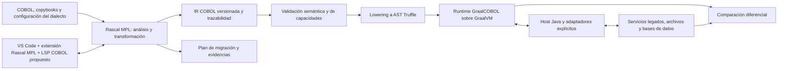

# GraalCOBOL

Arquitectura propuesta para analizar, migrar y ejecutar un subconjunto explícito de COBOL mediante **Rascal MPL**, **Truffle** y **GraalVM**, con integración gradual con sistemas existentes.

> **Estado:** diseño, sin implementación ejecutable. La revisión del 7 de octubre de 2026 sobre `a632dc7f966ee6bec1d2dc5f825c97fdf801d71c` encontró únicamente el README. Este cambio añade documentación; todavía no existen parser COBOL, módulos Rascal, runtime Truffle, adaptadores ni pruebas de ejecución.

## Arquitectura general



**Rascal MPL** significa *Rascal Meta Programming Language*. Su extensión de VS Code es un entorno de trabajo para lenguajes; no incorpora por sí sola un migrador COBOL ni convierte Rascal en un lenguaje invitado de Truffle. Se propone desarrollar sobre Rascal una capa específica de COBOL y conectar sus artefactos con el runtime. [Rascal MPL](https://www.rascal-mpl.org/), [extensión oficial](https://marketplace.visualstudio.com/items?itemName=usethesource.rascalmpl).

## Documentación

| Documento | Contenido |
| --- | --- |
| [Arquitectura de integración](docs/architecture/integration.md) | Componentes, contratos, runtime, datos, adaptadores y despliegue |
| [Rascal MPL y migración COBOL](docs/architecture/rascal-cobol.md) | Frontend, M3, transformaciones, extensión de VS Code y decisiones |
| [Cobrix y adaptador Trino](docs/architecture/cobrix-trino.md) | Ingesta, contrato de datos, cliente JDBC y conector directo propuesto |
| [Laboratorio Hercules/Hyperion](docs/training/mainframe-lab.md) | Emulación, actualización del fork, portal WebJCL y ruta IBM i separada |
| [Capacitación y competencias](docs/training/competencies.md) | Seis áreas, ejercicios y evidencias separadas de años laborales |
| [Referencias y hallazgos](docs/references/projects.md) | Seis repositorios revisados y requisitos para convertirlos en corpus |
| [Plan y criterios de migración](docs/migration/roadmap.md) | Subconjunto inicial, pruebas diferenciales, entregables y retorno al legado |

## Laboratorio y ecosistema de integración

La propuesta incorpora **Hercules/Hyperion** como entorno de emulación con sistema invitado separado; **Payroll** como caso batch; **Mastering JCL**, **Cash Account COBOL** y **WebJCL** como material curricular, caso CICS/DB2 y portal complementario. **Cobrix** se dedica a datos/copybooks y **Trino** al acceso analítico.

Se definen una ruta Cobrix → Spark → Iceberg → Trino, un adaptador cliente Java/JDBC y una alternativa futura de conector directo de lectura. El laboratorio cubre COBOL, batch/online, JCL, SQL/DML, DB2 y Embedded SQL; IBM i/AS400 tiene un perfil separado. Todo está en fase de diseño y los repositorios de referencia no se modifican aquí.

## Capacidades previstas y límites

| Área | Objetivo | Estado |
| --- | --- | --- |
| Análisis y modernización | Inventario, dependencias, layouts y transformaciones trazables con Rascal | Propuesto |
| Ejecución COBOL | Intérprete Truffle con semántica definida por dialecto | Propuesto |
| Rendimiento | Evaluar interpretación, calentamiento JIT y ejecución estable | Sin mediciones |
| Interoperabilidad | Contratos de registros, decimales y llamadas mediante host Java/Polyglot | Por implementar |
| SQL, archivos y transacciones | Adaptadores por entorno; coexistencia con servicios legados | Fuera del primer piloto |
| Native Image | Evaluación posterior del empaquetado del host/intérprete | No equivale a un compilador COBOL AOT ya disponible |

La interoperabilidad requiere implementar el protocolo de Truffle y probar cada lenguaje invitado elegido. No se promete compatibilidad automática con Node.js, R ni librerías de cualquier runtime. La guía oficial explica el papel del host Java y de las dependencias de cada lenguaje. [Polyglot embedding](https://www.graalvm.org/latest/reference-manual/embed-languages/).

## Cómo comenzar

El repositorio puede clonarse para revisar el diseño:

```bash
git clone https://github.com/sdk2035/GraalCOBOL.git
cd GraalCOBOL
```

Todavía no hay un comando de compilación ni un programa COBOL ejecutable. El primer hito consiste en fijar versiones compatibles, crear el build y demostrar el recorrido fuente → Rascal → IR → Truffle → resultado contra un programa de referencia. No se presupone que cualquier JDK “21 o superior” sea compatible: la matriz exacta se debe fijar y verificar en ese hito.

## Criterio de aceptación

Una migración se acepta por equivalencia observable en el alcance declarado: resultados, precisión, estado persistente, errores y contratos externos. La cobertura sintáctica y la mejora de rendimiento, por sí solas, no demuestran equivalencia. Véase el [plan de validación](docs/migration/roadmap.md).
