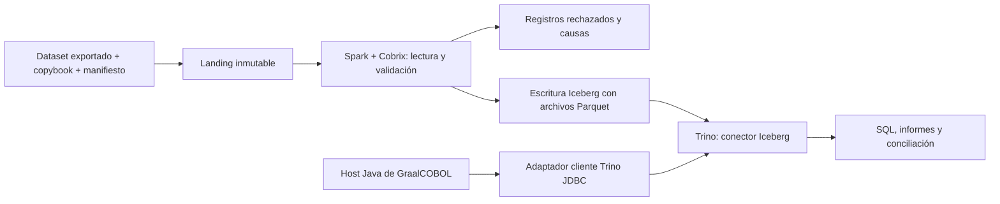

# Cobrix, datos COBOL y adaptador Trino

**Estado:** diseño propuesto, sin conector compilado ni ingesta ejecutada. Complementa la [arquitectura de ejecución](integration.md).

## 1. Tres integraciones diferentes

| Integración | Responsabilidad | Límite |
| --- | --- | --- |
| Rascal → IR → Truffle | Migrar y ejecutar lógica COBOL | No interpreta automáticamente datasets binarios |
| Cobrix → datos tipados | Decodificar registros a partir de copybooks y configuración | No ejecuta PROCEDURE DIVISION, JCL ni CICS |
| Host Java → Trino / conector Trino → datos | Consultas analíticas y acceso federado | No sustituye el runtime transaccional DB2/CICS |

El [fork Cobrix examinado](https://github.com/sdk2035/cobrix/tree/8750ebb6d962333cf6ae9477e1b3e475eda59175) procede de AbsaOSS/cobrix. Su README describe un datasource Spark y un parser de copybooks reutilizable sin Spark. La separación se refleja en los módulos `cobol-parser` y `spark-cobol`. Se propone evaluar ambas vías con versiones fijadas, sin asumir que las dependencias Scala/Spark del fork sean compatibles con Trino.

## 2. Ruta inicial: ingesta y tablas analíticas

Decisión propuesta: usar primero el conector Iceberg de Trino y añadir valor en la normalización/validación COBOL. Cobrix produce datos para Spark; un escritor Iceberg separado publica tablas. Escribir archivos Parquet sueltos no crea por sí solo una tabla Iceberg: se necesitan metadatos y catálogo. [Conector oficial Iceberg](https://trino.io/docs/current/connector/iceberg.html).

El manifiesto de cada extracción incluirá: snapshot/job de origen, hash de bytes, copybook y versión, code page, RECFM/LRECL, representación efectiva de bloques/headers en el archivo exportado, política de variantes REDEFINES, conteos y totales de control. El RECFM del dataset no basta para deducir los headers que permanecen después de transferirlo.

DASD/CCKD son imágenes de dispositivos, no registros que deban enviarse directamente a Cobrix. Extraer datasets mediante utilidades del sistema invitado o una herramienta de exportación validada; no leer una imagen activa como si fuera un archivo secuencial. Conservar copia binaria original y registrar cualquier conversión.

**Publicación:** escribir a staging, verificar `leídos = aceptados + rechazados`, reconciliar importes y publicar el snapshot de tabla solo al aprobar. Un reintento con la misma identidad de ingesta no duplica filas. CDC de DB2 es una capacidad adicional, no ofrecida automáticamente por Cobrix.

## 3. Contrato de tipos

| Origen COBOL | Destino propuesto | Comprobación |
| --- | --- | --- |
| PIC X(n) | VARCHAR con longitud original en metadatos | Encoding, espacios y bytes no decodificables |
| PIC 9 / S9 / V y COMP-3 | DECIMAL(p,s) exacto cuando cabe | Signo, escala, packed decimal inválido y overflow |
| Identificador con ceros iniciales | VARCHAR si el dominio es identificador | No perder los ceros convirtiéndolo a cantidad |
| COMP/binario | Entero o DECIMAL según rango | Endian/tamaño del perfil; nunca inferir por la máquina host |
| Grupos y OCCURS | ROW y ARRAY, o aplanado explícito | Orden, dimensiones y longitud efectiva |
| REDEFINES | Variante seleccionada por discriminador documentado | No tratar todas las vistas como datos independientes |
| Fechas codificadas | VARCHAR inicial; DATE solo con formato validado | Fechas imposibles y sentinelas |
| Valores especiales/blancos | Política de nulos por campo | No convertir espacios o cero a NULL universalmente |

Trino DECIMAL admite hasta 38 dígitos en la documentación consultada. Fuera de ese contrato, rechazar o conservar cadena/bytes con anotación; no degradar a coma flotante. [Tipos Trino](https://trino.io/docs/current/language/types.html).

Rascal y Cobrix no comparten automáticamente modelo de layout. Un adaptador de esquema debe contrastar nombres cualificados, offsets, longitud, escala y variantes con fixtures comunes. Las discrepancias bloquean publicación; no se afirma equivalencia de sus parsers.

## 4. Adaptador cliente moderno para GraalCOBOL

Módulo futuro `adapters/trino-client/`, ejecutado por el host Java:

- Configuración externa de coordinator, catálogo, esquema y autenticación, con HTTPS.
- Consultas parametrizadas de plantillas autorizadas; identidad de usuario/servicio y política de acceso.
- Límites de tiempo/filas, cancelación, paginación o consumo incremental y cierre de recursos.
- Conversión exacta de DECIMAL/NULL/fecha y propagación de errores como errores Trino identificados; no inventar SQLCODE DB2 equivalentes.
- Correlación entre invocación COBOL, consulta, snapshot y resultado; logs sin credenciales ni datos de nómina.
- Lectura por defecto. DML habilitado únicamente por catálogo y operación verificada; ninguna promesa de transacción distribuida con DB2/CICS.

El driver oficial conecta aplicaciones JVM al coordinator mediante el protocolo cliente. Fijar y probar versiones compatibles de servidor, driver y JDK en su propio proceso; no heredar ciegamente el JDK del runtime COBOL. [Trino JDBC](https://trino.io/docs/current/client/jdbc.html).

## 5. Segunda vía: conector directo de lectura

Módulo futuro `connectors/trino-cobol/`, justificable cuando evitar una copia analítica sea un requisito medido. Usará la parte de parsing/decodificación Cobrix compatible con el alcance seleccionado; no cargará Spark dentro de workers Trino.

El SPI de Trino ofrece fábricas, metadatos, planificación de splits y proveedores de páginas/registros. Debe compilarse y probarse con la misma versión del clúster elegido. [SPI](https://trino.io/docs/current/develop/spi-overview.html), [desarrollo de conectores](https://trino.io/docs/current/develop/connectors.html).

| Pieza propuesta | Contrato |
| --- | --- |
| Plugin y ConnectorFactory | Registro del catálogo y configuración validada |
| ConnectorMetadata | Tablas declaradas por manifiesto/copybook versionado; tipos y capacidades de solo lectura |
| ConnectorSplitManager | Particiones por límites reales de registro y snapshot estable |
| ConnectorPageSourceProvider | Decodificación acotada en memoria; errores con offset sin exponer contenido |
| Handle de tabla/split | Identidad del dataset inmutable, versión de esquema, ubicación autorizada e intervalo válido |
| Métricas | Bytes, filas, rechazos, tiempo de decodificación y cancelación |

Comenzar con registros fijos sin compresión. Los variables RDW/BDW necesitan índice o estrategia secuencial que no corte registros; compresión y multisegmento son capacidades posteriores. Un objeto debe permanecer estable toda la consulta; cambio de versión implica error o lectura de la versión fijada.

Solo anunciar proyección/predicate pushdown cuando produzca el mismo resultado que el filtrado en Trino, incluidos nulos y orden de comparación. No ejecutar programas COBOL como efecto de un SELECT. No exponer escritura ni reintentos de operaciones transaccionales en este conector.

## 6. Pruebas de aceptación

- Fixtures de encoding, decimal con signo, variantes, registros truncados y layouts incompatibles.
- Igualdad de filas, claves y totales entre extracción de referencia, Cobrix y Trino.
- Ninguna pérdida/duplicación por splits o por reintentos de ingesta.
- Cancelación, límites de memoria y rechazo de rutas/catalogación no autorizadas.
- Pruebas reales del plugin contra la versión exacta de Trino, si se construye la vía directa.
- DML y COMMIT/ROLLBACK del curso se validan en su base transaccional; los ejercicios Trino identifican las capacidades del catálogo utilizado.

[Laboratorio mainframe](../training/mainframe-lab.md) · [Casos de referencia](../references/projects.md) · [README](../../README.md)
