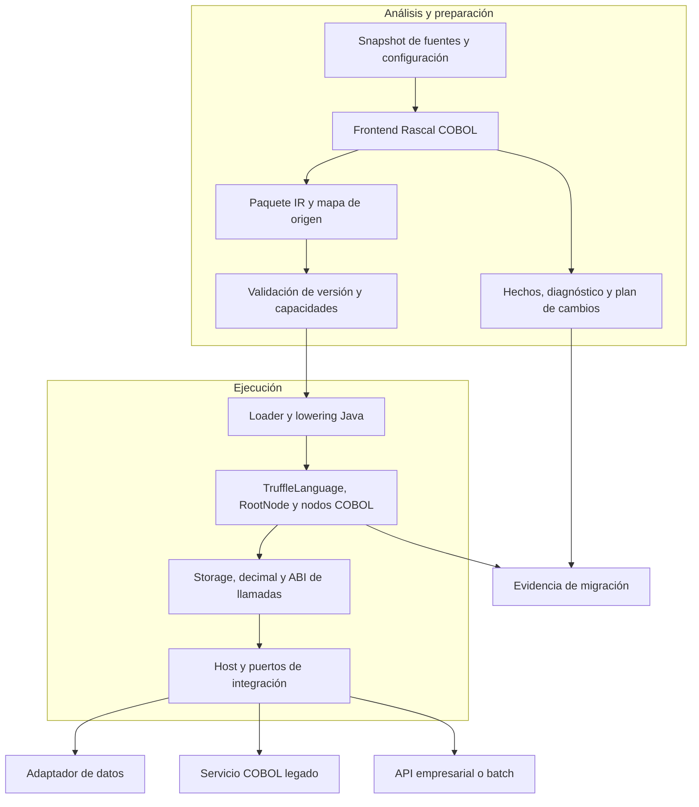
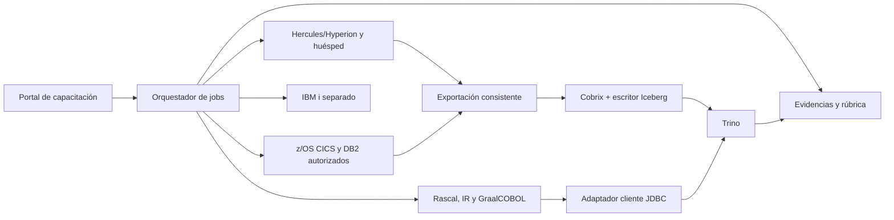

# Arquitectura de integración de GraalCOBOL

**Estado:** propuesta revisada el 7 de octubre de 2026. Los nombres de módulos, contratos y decisiones siguientes son diseño del proyecto, no APIs publicadas ni componentes existentes.

## 1. Revisión del punto de partida

El commit base `a632dc7f966ee6bec1d2dc5f825c97fdf801d71c` contiene solamente un README. No aporta evidencia para afirmar alto rendimiento, compatibilidad COBOL general, interoperabilidad sin adaptación o generación nativa. También anuncia un comando Gradle sin wrapper y deja abierto su bloque de código. El README revisado corrige estas instrucciones y presenta las capacidades como objetivos.

La integración necesita resolver dos problemas distintos: comprender y transformar el patrimonio COBOL; ejecutar fielmente el subconjunto seleccionado. Rascal se propone para el primero y Truffle para el segundo. El artefacto de enlace será una representación intermedia (IR) independiente de ambas implementaciones.

## 2. Componentes y responsabilidades

Los directorios de esta tabla son una distribución futura; no se crean módulos vacíos en esta revisión.

| Módulo propuesto | Responsabilidad | Entrada → salida |
| --- | --- | --- |
| `migration-rascal/` | Preprocesamiento, parsing, resolución, análisis y reglas revisables | Fuentes/configuración → AST semántico, hechos y diagnósticos |
| `cobol-ir/` | Contrato neutral y validadores de versión/capacidades | AST semántico → paquete IR reproducible |
| `language-truffle/` | Carga del paquete, lowering e interpretación | IR validada → nodos ejecutables |
| `runtime-core/` | Almacenamiento COBOL, aritmética, llamadas y estado | Operaciones semánticas → resultados/errores |
| `integration-host/` | Ciclo de vida de contextos, contratos externos y políticas | Solicitud tipada → invocación y respuesta |
| `adapters/` | Archivos, datos y acceso a legado por capacidad | Operaciones del runtime → servicio autorizado |
| `ide/` | Funciones COBOL sobre el LSP parametrizable de Rascal | Edición → diagnósticos, navegación y propuesta de cambios |
| `conformance/` | Corpus, ejecutor de referencia y comparación | Mismas entradas → diferencias reproducibles |

Se propone ejecutar Rascal como proceso JVM de herramientas y publicar artefactos inmutables. El runtime no debe lanzar análisis Rascal por solicitud ni interpretar texto fuente sin pasar por las mismas comprobaciones. El modo de desarrollo podrá invocar el frontend explícitamente, manteniendo idéntico contrato.

## 3. Contrato del paquete IR

**Decisión propuesta:** empezar con serialización JSON explícita y validación estructural; evitar serialización nativa de objetos Java/Rascal como interfaz pública. Un esquema formal y sus pruebas son entregables del primer hito, todavía no existen.

| Campo/artefacto | Regla del contrato propuesto |
| --- | --- |
| `schemaVersion` | Versión mayor/menor; rechazar mayores desconocidas y campos críticos no reconocidos |
| `programId`, `entryPoints` | Identidad cualificada y firmas; no depender únicamente del nombre de archivo |
| `dialectProfile` | Dialecto, opciones del compilador de referencia, formato y reglas numéricas seleccionadas |
| `sourceManifest` | Rutas relativas, hashes de fuentes/copybooks, orden de búsqueda y versiones de herramientas |
| `requiredCapabilities` | Lista cerrada de operaciones necesarias; un loader sin una capacidad rechaza el paquete antes de ejecutar |
| `dataLayouts` | PIC/USAGE, signo, escala, longitud en bytes, offsets, alias y tablas según el perfil |
| `procedures` | Operaciones semánticas tipadas, control explícito y destinos de llamada |
| `sourceMap` | Nodo IR → intervalo de fuente original y cadena de expansión de COPY |
| `diagnostics` | Código, gravedad, localización y condición que impide publicar |
| `migrationManifest` | Identidad de reglas aplicadas, entradas/salidas, evidencia y revisión |
| `artifactDigest` | Digest de los bytes canónicos del paquete, con este campo excluido; cálculo definido por el esquema |

El loader valida límites de tamaño/profundidad, referencias de nodos, firmas, layouts y capacidades. No permite paths absolutos ni rutas que escapen del paquete. El digest detecta cambios; la autenticidad requiere además procedencia verificable del repositorio/registro de artefactos.

Los decimales y enteros arbitrarios viajarán como cadenas con metadatos, no como números JSON sujetos a pérdida de precisión. El orden de conjuntos y mapas debe ser canónico. Una versión de reglas y los hashes de todos los copybooks forman parte de la clave de caché.

La IR no es el modelo M3 de análisis: necesita instrucciones ejecutables y reglas de almacenamiento. Tampoco es un AST Truffle serializado; el loader construye nodos propios de la versión del runtime.

## 4. Runtime y semántica COBOL

La implementación prevista registrará un `TruffleLanguage`, creará raíces de programa y traducirá instrucciones IR a nodos especializados. Truffle documenta estas piezas, pero su existencia no proporciona semántica COBOL. [TruffleLanguage](https://www.graalvm.org/truffle/javadoc/com/oracle/truffle/api/TruffleLanguage.html), [RootNode](https://www.graalvm.org/truffle/javadoc/com/oracle/truffle/api/nodes/RootNode.html).

| Área | Decisión de diseño y comprobación necesaria |
| --- | --- |
| Decimal | Representación exacta; escala y redondeo por operación/receptor; nunca convertir importes implícitamente a `double` |
| Alfanuméricos | Longitud fija, relleno, truncamiento, comparación y juego de caracteres explícitos |
| Storage | Descriptor de layout más región de bytes; cuando se habilite REDEFINES, sus vistas deben compartir almacenamiento |
| Tablas | Límites, índices/subíndices y longitud efectiva; OCCURS DEPENDING ON requiere semántica y pruebas propias |
| Control | Modelar párrafos, secciones, PERFORM y fall-through antes de reestructurar a funciones Java |
| Llamadas | ABI explícita para BY REFERENCE, BY CONTENT y BY VALUE; alias, efectos y duración del almacenamiento |
| Ciclo de vida | WORKING-STORAGE, LOCAL-STORAGE, estado de programa y CANCEL según el perfil habilitado |
| Errores | Conservar condiciones observables, FILE STATUS, códigos de retorno y ON SIZE ERROR cuando se soporten |

Estas filas son obligaciones para futuras capacidades, no una declaración de soporte. La [matriz de alcance](../migration/roadmap.md) limita el primer piloto. Un constructo reconocido pero no implementado debe producir un error bloqueante; no se reemplaza silenciosamente por un no-op.

## 5. Interoperabilidad y fronteras de datos

`InteropLibrary` define mensajes para compartir valores entre lenguajes. GraalCOBOL necesitará exportar los mensajes aplicables a registros, arrays y ejecutables, y establecer sus conversiones; compartir un registro no equivale a compartir automáticamente su layout binario. [Referencia oficial](https://www.graalvm.org/truffle/javadoc/com/oracle/truffle/api/interop/InteropLibrary.html).

| Frontera | Contrato propuesto |
| --- | --- |
| Java ↔ COBOL | DTO/valor explícito, validación de longitud/escala; vistas mutables solo dentro de una invocación autorizada |
| COBOL ↔ JSON/API | Decimal como cadena, versión de esquema, encoding; diferenciar campo ausente, nulo y espacios |
| BY REFERENCE dentro del runtime | Vista sobre storage con identidad y duración definidas; probar alias entre parámetros |
| Servicio remoto | Copia de valores; no prometer semántica de memoria compartida ni equivalencia automática con BY REFERENCE |
| Archivos legados | Bytes originales, formato de registro, code page y endian cuando corresponda; conversión reversible probada |
| Otros invitados Truffle | Prueba independiente por lenguaje y versión; no asumir que un módulo de Node.js sirve como librería embebible |

El host recibe una solicitud validada, selecciona versión de programa y contexto, invoca el entry point y convierte la respuesta. Un contexto es por trabajo o sesión explícitamente gestionada; el diseño inicial prohíbe uso concurrente del mismo contexto. Solo artefactos y metadatos inmutables se comparten. No retornar referencias Polyglot ligadas a un contexto cerrado.

La integración con una aplicación empresarial se realizará mediante un puerto de servicio versionado. Por ejemplo, una aplicación ERP puede enviar una solicitud de cálculo y recibir importe/código de resultado sin acceder al storage COBOL. Esta es una opción arquitectónica, no una integración ya realizada con otro repositorio.

## 6. Adaptadores y coexistencia

- **Archivos:** abstraer apertura, lectura, escritura y estado; empezar más adelante por un formato definido. VSAM y archivos indexados requieren adaptador específico y pruebas de locking, claves y reinicio.
- **SQL/DB2:** inventariar EXEC SQL y separar precompilación, variables host, indicadores de nulo, SQLCODE/SQLSTATE y límites transaccionales. JDBC puede ser una implementación de puerto; no sustituye automáticamente la semántica DB2.
- **CICS/IMS:** conservar operaciones como capacidades externas durante el análisis. El primer piloto las rechaza; una fase posterior elegirá conservar el servicio legado o implementar un contrato respaldado por pruebas.
- **JCL/batch:** inventariar jobs, datasets, condiciones, pasos y códigos de retorno. El orquestador de jobs es una capa distinta del intérprete COBOL.
- **Servicios externos:** contratos versionados, timeout, identificador de correlación y política de reintento específica. Una escritura no idempotente no se reintenta automáticamente.

Cada operación con efectos tiene un dueño de la transacción. No afirmar atomicidad distribuida entre base de datos, archivos y servicios. Durante coexistencia, mantener un único escritor por unidad de negocio; el modo sombra se ejecuta con entradas capturadas y salidas aisladas.

## 7. Despliegue, acceso y observabilidad

La primera ejecución será JVM. Rascal y su IDE pertenecen al entorno de desarrollo/build; el servicio de producción recibe IR aprobada, runtime y adaptadores seleccionados. El proceso tiene límites de CPU, memoria, tiempo y acceso externo. Las rutas y endpoints se autorizan en el host, con credenciales fuera del paquete.

Las opciones de acceso de Polyglot ayudan a delimitar interfaces, pero no deben anunciarse como sandbox certificado para un lenguaje COBOL propio. Su cobertura depende del lenguaje y configuración. [Embedding](https://www.graalvm.org/latest/reference-manual/embed-languages/), [sandboxing](https://www.graalvm.org/latest/security-guide/sandboxing/).

La telemetría registra digest del programa, dialecto, entrada funcional, duración, resultado y errores con mapa de origen. No registra por defecto contenido de registros financieros/personales. Medir por separado análisis, carga, arranque, calentamiento JIT, throughput estable y memoria.

Native Image se evalúa después: empaquetaría el host/intérprete y sus dependencias bajo restricciones de mundo cerrado; no prueba conversión directa de cualquier COBOL a código máquina ni garantiza igual comportamiento JIT. Validar recursos, inicialización, reflexión, adaptadores y carga de nuevos paquetes de datos frente a nuevo código Java. [Guía de compatibilidad](https://www.graalvm.org/latest/reference-manual/native-image/metadata/Compatibility/).

## 8. Laboratorio, datos y herramientas complementarias

La arquitectura se amplía con tres servicios externos al intérprete:

1. **Orquestador de prácticas/jobs:** portal inspirado en WebJCL con backends de invitado Hercules/Hyperion, z/OS autorizado e IBM i separado. El emulador ejecuta la plataforma legada; no se convierte en una dependencia del runtime Truffle.
2. **Ingesta y análisis de datos:** extracción de datasets → Cobrix → publicación Iceberg → Trino. Un adaptador cliente Trino del host consulta resultados; un conector directo de lectura es una alternativa futura.
3. **Repositorio de evidencias:** relaciona fuente, configuración, job, artefactos, resultados diferenciales y competencias; no calcula años de experiencia a partir de horas de curso.

Payroll y Cash son corpus candidatos, no pruebas ya aprobadas. La [revisión de referencias](../references/projects.md) identifica diferencias de copybooks/reportes, DDL/bind, semántica COND y dependencias antiguas antes de su adopción. Los contratos específicos están en [Cobrix–Trino](cobrix-trino.md), [laboratorio](../training/mainframe-lab.md) y [competencias](../training/competencies.md).

## 9. Decisiones y asuntos abiertos

| Decisión propuesta | Motivo | Alternativa pendiente |
| --- | --- | --- |
| Rascal fuera del camino de ejecución | Separar análisis pesado del servicio y facilitar reproducibilidad | Integración JVM directa solo si un caso medido la necesita |
| IR neutral como frontera | Evitar acoplamiento entre valores Rascal y nodos Truffle | Evaluar formato binario tras medir JSON |
| Frontend único para herramientas y runtime | Evitar dos interpretaciones del dialecto | Parser externo solo con adaptador y corpus equivalentes |
| Semántica antes de optimización | Impedir que rendimiento o simplificación oculten cambios funcionales | Ninguna optimización sin regresión diferencial |
| JVM antes de Native Image | Reducir variables del primer experimento | AOT como estudio separado |
| Legado por contrato explícito | Migración por componentes y retorno controlado | Reescritura completa fuera del piloto |

Quedan por fijar: dialecto/compilador de referencia, licencias de gramática y corpus, conjunto exacto de instrucciones iniciales, versiones JDK/Rascal/Truffle, ABI y esquema IR. Los hitos para resolverlos están en el [plan de migración](../migration/roadmap.md).

[Volver al README](../../README.md) · [Diseño Rascal](rascal-cobol.md)
