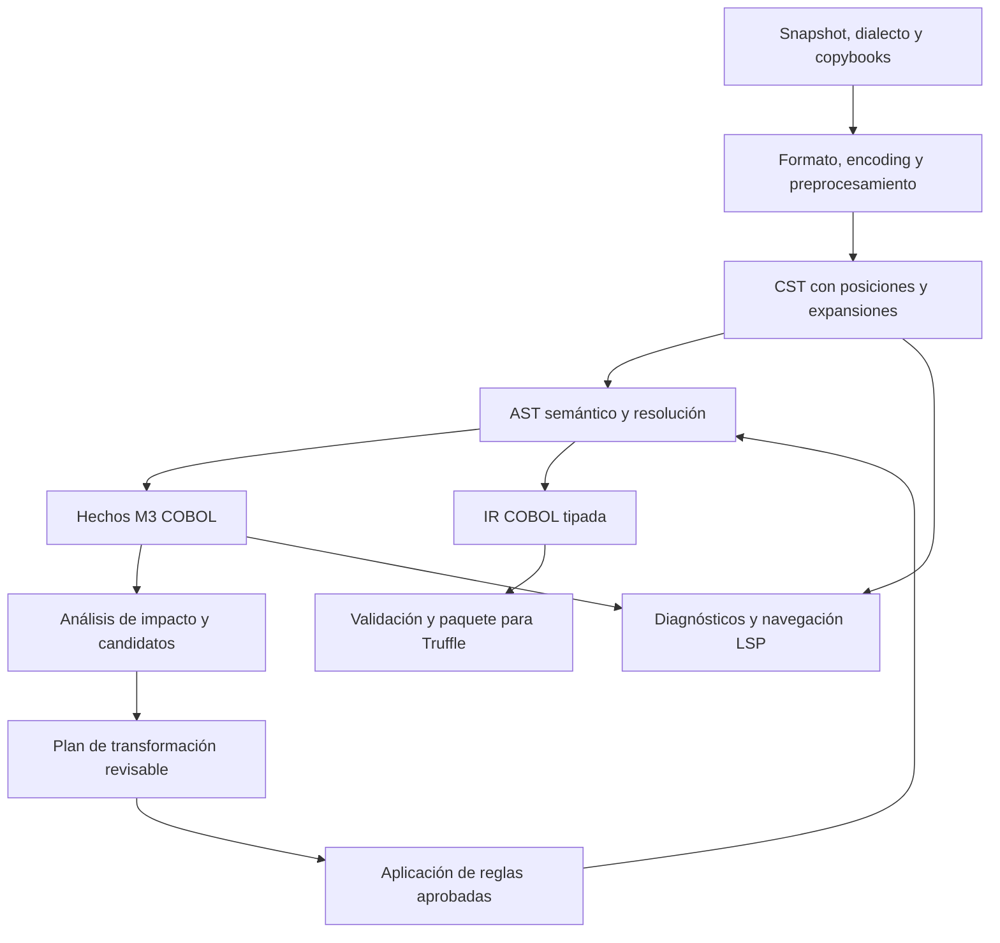

# Rascal MPL para el análisis y la migración de COBOL

**Estado:** extensión COBOL propuesta sobre Rascal MPL. No hay una extensión GraalCOBOL publicada ni módulos Rascal implementados en este repositorio.

## 1. Qué se integra

MPL es parte del nombre *Rascal Meta Programming Language*. Hay que distinguir:

1. **Lenguaje y herramientas Rascal:** análisis, transformación y generación de código.
2. **Extensión oficial de VS Code** `usethesource.rascalmpl`: soporte de Rascal y entorno para lenguajes definidos con sus herramientas.
3. **Frontend/extensión COBOL de GraalCOBOL:** gramática, resolución, reglas y funciones de editor que este proyecto deberá desarrollar.
4. **Runtime Truffle:** ejecutor independiente de los artefactos resultantes.

La extensión oficial ofrece R-LSP para Rascal y P-LSP parametrizable para otros lenguajes. No se verificó un paquete COBOL reutilizable adecuado para este proyecto en el directorio oficial; esto no demuestra que no exista fuera de él. La selección de gramática sigue abierta y requiere revisión de licencia, dialecto y corpus. [Extensión oficial](https://marketplace.visualstudio.com/items?itemName=usethesource.rascalmpl), [directorio de paquetes](https://www.rascal-mpl.org/docs/Packages/).

## 2. Pipeline propuesto

### Ingesta y preprocesamiento

Registrar los bytes originales, code page, formato fijo/libre, opciones del dialecto y orden determinista de directorios de copybooks. Resolver COPY y COPY REPLACING conservando un mapa de expansión hacia archivo, línea y columna originales. Detectar ciclos, faltantes y duplicados ambiguos. No normalizar columnas o continuaciones antes de identificar el formato.

Cada configuración de compilación es una unidad de análisis: el mismo copybook puede producir layouts distintos bajo opciones diferentes. Inventariar JCL, SQL y CICS como dependencias; no interpretar estos dialectos como si fueran instrucciones COBOL ordinarias.

### Parsing y AST semántico

Evaluar una gramática Rascal para el subconjunto piloto; considerar un parser externo únicamente si exporta estructura, posiciones y diagnósticos suficientes. La composición de gramáticas de Rascal es una herramienta para organizar extensiones, no evidencia de cobertura de un dialecto COBOL. [Grammar](https://www.rascal-mpl.org/docs/Library/Grammar/).

Mantener CST para comentarios y origen; construir AST semántico para nombres cualificados, declaraciones, PIC/USAGE, control y llamadas. Un árbol recuperado para mostrar diagnósticos en el IDE no se considera válido para emitir IR ejecutable. La ambigüedad no resuelta bloquea publicación.

### Modelo M3 y análisis

M3 aporta relaciones de declaraciones, usos, contención y tipos, ampliables por lenguaje. Su documentación diferencia hechos extraídos de inferencias y advierte que un modelo común no iguala semánticas entre lenguajes. [M3 Core](https://www.rascal-mpl.org/docs/Library/analysis/m3/Core/).

Extensiones propuestas de GraalCOBOL:

| Hecho extraído | Uso previsto |
| --- | --- |
| Programa contiene sección/párrafo/dato | Navegación y unidades candidatas a migración |
| Expansión COPY depende de copybook/opciones | Invalidación de caché y análisis de impacto |
| Referencia usa declaración cualificada | Resolución, renombrado y detección de conflictos |
| CALL literal referencia entry point resuelto | Dependencias estáticas verificadas |
| Descriptor de dato referencia layout y almacenamiento | Compatibilidad de parámetros y copybooks compartidos |
| Operación requiere archivo/SQL/CICS/servicio | Inventario de capacidades externas |

Guardar por separado los destinos posibles de CALL dinámico, aproximaciones de flujo de datos y sugerencias de extracción: son resultados derivados, con supuestos y grado de incertidumbre. Un destino no resuelto nunca se interpreta como “sin dependencias”. El esquema M3 COBOL y su extractor son entregables futuros; no basta con importar un modelo de Java.

### Transformaciones y generación

Empezar por reglas pequeñas sobre el AST semántico, con identidad/versionado, precondiciones, cambios esperados y pruebas. Por ejemplo, extraer un cálculo como servicio solo después de comprobar sus lecturas/escrituras, alias, precisión, control de salida y llamadas externas. Mantener invocación legada si esas condiciones no se resuelven.

Cada regla genera un diff de fuente o IR, actualiza el mapa de origen y vuelve a ejecutar resolución y validación. Conservar original y resultado; una propuesta de IA, si se incorpora en el futuro, se trata como cambio no confiable sujeto al mismo circuito.

La salida inicial será IR para GraalCOBOL, no traducción automática a Java/Python. Un backend de generación de código fuente sería un proyecto posterior con pruebas semánticas propias.

## 3. Extensión de VS Code y LSP

`util::LanguageServer` permite conectar parsers, analizadores y transformaciones Rascal con LSP. [Documentación oficial](https://www.rascal-mpl.org/docs/Packages/org.rascalmpl.rascal-lsp/Library/util/LanguageServer/).

Funciones propuestas:

- Asociar extensiones COBOL configurables, inicialmente `.cbl`, `.cob` y `.cpy`.
- Diagnósticos por dialecto, definición/referencias entre programas y copybooks, y vista de dependencias.
- Mostrar preview de una transformación y sus precondiciones; aplicar cambios solo tras aceptación del usuario.
- Asociar cada diagnóstico al original, incluso dentro de COPY expandido.
- Cancelar análisis obsoletos y etiquetar resultados con versión del documento/configuración.
- Distinguir buffers sin guardar de snapshots reproducibles: solo el build del snapshot publica artefactos.
- Permitir la misma validación sin VS Code en CI; el editor no es dependencia del runtime.

No se incluye un comando de registro inventado ni una configuración de extensión supuestamente ejecutable. El prototipo deberá fijar una versión del paquete `rascal-lsp` y probar su API real.

## 4. Integración de herramientas y versiones

Elegir Maven para el futuro build de herramientas es una decisión propuesta; crear el POM y wrapper será parte del primer hito. Las dependencias Rascal se declararán con versiones explícitas y se contrastarán con las notas de versión del LSP. Las versiones de extensión VS Code, LSP y Rascal no deben suponerse iguales. [Notas oficiales](https://www.rascal-mpl.org/docs/Packages/org.rascalmpl.rascal-lsp/RELEASE-NOTES/).

La matriz reproducible registrará:

| Componente | Evidencia requerida antes de fijarlo |
| --- | --- |
| JDK de herramientas | Carga de Rascal, parsing del corpus y pruebas sin IDE |
| Rascal, plugin Maven y LSP | Build, resolución de dependencias y navegación reproducible |
| JDK/GraalVM de runtime | Registro del lenguaje y ejecución interpretada/JIT |
| Truffle API, procesador DSL, runtime y Polyglot SDK | Familia compatible probada en conjunto |
| Sistema operativo y arquitectura | Misma suite funcional y dependencias de adaptadores |
| Native Image opcional | Build y ejecución diferenciados; no condición del primer piloto |

Herramientas y runtime pueden usar JDK distintos gracias al contrato IR. No introducir un requisito genérico “JDK 21+” como sustituto de esta matriz.

## 5. Contrato de entrega y evaluación del frontend

Antes de conectar el frontend al runtime:

1. Publicar perfil del dialecto, gramática y licencias del material reutilizado.
2. Demostrar parsing positivo y negativo, posiciones originales y expansión COPY determinista.
3. Validar nombres cualificados y hechos M3 con un corpus pequeño cerrado.
4. Registrar inferencias e incertidumbres fuera de los hechos básicos.
5. Emitir la misma IR canónica para las mismas entradas y versiones.
6. Rechazar sintaxis fuera de alcance, referencias irresueltas y capacidades no habilitadas.
7. Comparar cada transformación con el ejecutor de referencia; no aceptar solo por compilar.

La separación Rascal → IR → Truffle introduce costo de serialización y doble modelado. Se acepta inicialmente para disponer de una frontera verificable y evolucionar el frontend sin empotrarlo en producción. Si las mediciones justifican otro enlace, conservar versión, validación y trazabilidad.

[Arquitectura de integración](integration.md) · [Plan de migración](../migration/roadmap.md) · [README](../../README.md)
