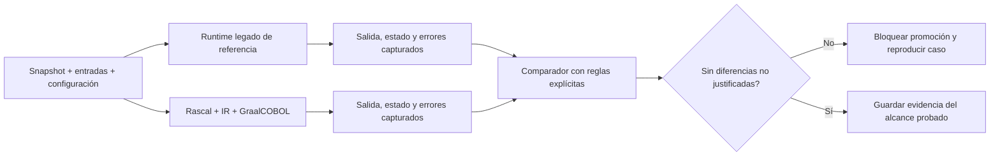

# Plan de migración y validación de COBOL

**Estado:** plan propuesto; ningún hito está completado por esta revisión documental.

## 1. Elegir un alcance verificable

El piloto será un programa batch pequeño, determinista y sin efectos externos. Debe fijar un dialecto y un compilador/runtime de referencia con versiones, flags y datos de prueba reproducibles. GnuCOBOL puede evaluarse como referencia para su propio perfil; no demuestra equivalencia de un programa IBM Enterprise COBOL sin evidencia específica.

No usar datos productivos como corpus público. Los ejemplos deben ser sintéticos o contar con permisos y tratamiento de datos adecuados.

| Familia | Alcance previsto del piloto | Tratamiento del resto |
| --- | --- | --- |
| Formato y estructura | Un formato seleccionado, divisiones mínimas y terminación de programa | Rechazo explícito de extensiones no declaradas |
| Datos | PIC X(n), enteros/decimales DISPLAY con precisión acotada y VALUE | COMP, COMP-3, REDEFINES, OCCURS y layouts avanzados en fases posteriores |
| Instrucciones | Selección explícita de MOVE, ADD/SUBTRACT, IF, DISPLAY y STOP RUN | Inventariar otras instrucciones; no emitir IR ejecutable para ellas |
| Condiciones numéricas | Signo, escala, truncamiento y resultado fuera de rango definidos para lo habilitado | ON SIZE ERROR/ROUNDED solo cuando su semántica esté implementada y probada |
| COPY | Al principio una fuente autocontenida; siguiente incremento con COPY y mapas de origen | COPY REPLACING, ciclos y variantes requieren pruebas específicas |
| Llamadas y control | Un entry point; sin CALL ni control entre párrafos en el primer incremento | Añadir PERFORM, fall-through y ABI antes de migrar programas que los usen |
| I/O y transacciones | Entrada de prueba y salida capturada | Archivos, SQL, CICS, IMS y JCL fuera del ejecutor piloto |

Esta tabla no anuncia soporte actual. Incluso cada instrucción seleccionada necesita especificación del perfil; reconocer su palabra clave no acredita todas sus variantes.

## 2. Hitos con puertas de aceptación

| Hito | Entregable | Condición para avanzar |
| --- | --- | --- |
| H0 — Contrato y build | Matriz de versiones, build mínimo, licencias, perfil y corpus | Reproducible en entorno limpio; ninguna instrucción documental ficticia |
| H1 — Frontend Rascal | Parser/AST, diagnósticos y mapa de origen | Corpus positivo/negativo; errores bloquean emisión; casos fuera de alcance identificados |
| H2 — IR y ejecución mínima | Esquema, loader, registro Truffle y aritmética DISPLAY | Recorrido completo de un programa, validación del paquete y equivalencia de resultados |
| H3 — Dependencias y editor | COPY, hechos M3, impacto y LSP COBOL | Invalidación por copybook/configuración, navegación correcta y build sin IDE |
| H4 — Semántica ampliada | Layouts, control, ABI y pruebas por capacidad | Casos de alias, escala, overflow, estado y retorno satisfechos |
| H5 — Integración | Un adaptador/servicio con contratos y límites transaccionales | Fallos/reintentos/reinicio probados; evidencias de efectos equivalentes |
| H6 — Coexistencia | Enrutamiento, ejecución sombra y plan de retorno | Reconciliación, dueño único de escritura y ensayo de rollback |
| H7 — Rendimiento y AOT | Benchmark reproducible; estudio Native Image separado | Correctitud mantenida y resultados comparables, sin promesas de velocidad a priori |

El prototipo mínimo H2 no espera a todas las funciones del IDE. H3 añade productividad; no reemplaza las pruebas de ejecución.

## 3. Pruebas que debe implementar el proyecto

### Frontend y contratos

- Archivos con formatos válidos/inválidos, límites de columna, continuaciones y encoding.
- COPY faltante, ambigüedad de búsqueda, ciclos y cambio de dependencia transitiva.
- Nombres repetidos con cualificación y ubicaciones de errores después de expansión.
- Paquetes con versión incompatible, instrucción desconocida, referencias rotas o layout inválido: rechazo antes de ejecutar.
- Serialización determinista y separación entre hechos extraídos y destinos inferidos.
- Reglas de transformación con precondición falsa: no aplicarlas.

### Semántica del runtime

Cada capacidad futura aporta sus casos de prueba antes de activarse:

| Área | Casos de regresión necesarios |
| --- | --- |
| Decimal | Positivo/negativo/cero, escalas distintas, límites del receptor, redondeo y overflow |
| Texto | Relleno, truncamiento, espacios, orden de comparación y code page del perfil |
| Storage | REDEFINES con escritura visible en ambas vistas, alias entre argumentos y tablas variables |
| Control | PERFORM, límites THRU, fall-through y salidas que no equivalen a return de Java |
| Llamadas | BY REFERENCE/CONTENT/VALUE, firma incorrecta, CALL dinámico y estado entre invocaciones |
| Archivos/datos | EOF, FILE STATUS, locking, indicadores SQL y fallo/reinicio |
| Host | Precisión preservada, esquema incompatible, contexto cerrado y uso concurrente rechazado |

### Comparación diferencial

Capturar salida estándar, códigos de retorno, registros/bytes escritos y estado final del almacenamiento externo cuando proceda. Comparar decimal exactamente; cualquier tolerancia necesita justificación funcional previa. No normalizar espacios, orden, timestamps o errores indiscriminadamente: podrían ser parte del contrato.

Para tiempo, azar y servicios externos, usar entradas controladas o capturas reproducibles con la misma semántica en ambos ejecutores. Una suite finita aporta evidencia del alcance probado, no una demostración universal de equivalencia.

## 4. Flujo de migración por aplicación

1. **Inventariar:** programas, copybooks, jobs, archivos, bases de datos, transacciones y llamadas; registrar propietarios y criticidad.
2. **Clasificar:** ejecutable con capacidades actuales, requiere adaptador, requiere ampliación semántica o se mantiene en legado.
3. **Establecer referencia:** fijar compilador/opciones y resultados observables para entradas representativas.
4. **Proponer cambios:** Rascal produce dependencias, plan y diff con origen; revisar semántica y fronteras de servicio.
5. **Construir y verificar:** generar paquete IR y ejecutar validación/diferenciales; cualquier diferencia no aceptada bloquea.
6. **Ensayar coexistencia:** shadow sin escrituras productivas, fallos de adaptador, reinicio y conciliación.
7. **Promover por unidad:** enrutar un conjunto acotado, medir y conservar alternativa legada.
8. **Retirar legado:** solo cuando los propietarios acepten cobertura, operación, datos y recuperación.

Un CALL dinámico no resuelto, un cambio de layout compartido o una transacción partida bloquean la migración automática de esa unidad. El informe debe conservar ese pendiente en lugar de omitirlo del grafo.

## 5. Retorno y consistencia

Guardar versión anterior de programa, IR, adaptadores y configuración. El rollback de código es insuficiente si la nueva versión escribió datos incompatibles: comprobar compatibilidad del esquema, conversión inversa o recuperación desde checkpoint antes del corte.

Definir quién puede escribir, punto de corte, conciliación de operaciones en vuelo y manejo de solicitudes repetidas. Ensayar primero en un entorno aislado con registros sintéticos. Si no hay retorno de datos seguro, la promoción requiere un plan específico y no se habilita como cambio automático.

## 6. Métricas y evidencia

| Métrica | Interpretación |
| --- | --- |
| Programas analizados / inventariados | Cobertura de inventario; no implica ejecutabilidad |
| Programas que cumplen capacidades / candidatos | Alcance del runtime para la configuración elegida |
| Casos diferenciales sin discrepancia / ejecutados | Evidencia funcional con corpus y versión identificados |
| Llamadas/recursos no resueltos | Riesgo residual que debe conservarse visible |
| Tiempo de análisis, carga y calentamiento | Costos distintos del throughput de ejecución estable |
| Latencia, memoria y rendimiento estable | Medir mismo workload, hardware, datos y política de concurrencia |
| Incidentes, reintentos y conciliación | Evidencia operativa durante coexistencia |

El informe por promoción debe incluir hashes, versión del esquema, dialecto, herramientas, corpus, diferencias aceptadas con justificación, limitaciones conocidas y ensayo de retorno.

## 7. Hitos complementarios de laboratorio y datos

| Hito | Dependencia | Entregable y aceptación |
| --- | --- | --- |
| L-A — Perfil de emulación | Imagen autorizada y versiones fijadas | Comparar fork Hercules con Hyperion; IPL, jobs, spool y restore validados |
| L-B — Corpus y currículo | Revisión de Payroll, Cash y guía JCL | Corregir casos de referencia en copias trazables; mapear los seis temas a entornos |
| L-C — Portal | Backend de jobs disponible | Modernización inspirada en WebJCL con identidad, idempotencia y aislamiento |
| D-A — Ingesta | Exportación consistente y copybooks | Cobrix → Iceberg → Trino con conteos y totales conciliados |
| D-B — Cliente Trino | H5 y D-A | Adaptador host/JDBC con tipos exactos, cancelación y lectura autorizada |
| D-C — Conector directo opcional | Necesidad medida y fixtures D-A | Plugin de solo lectura; splits y compatibilidad SPI probados |
| L-D — IBM i | Acceso a sistema IBM i | Prácticas propias de CL/jobs/Db2 for i; no depender de Hercules |

L-A, L-B y D-A pueden avanzar independientemente del intérprete. Ejecutar los casos legados no acredita H4/H5; migrarlos requiere además las capacidades semánticas correspondientes. Véanse [laboratorio](../training/mainframe-lab.md), [competencias](../training/competencies.md) y [adaptador de datos](../architecture/cobrix-trino.md).

## 8. Validación de esta revisión

Se revisaron el árbol y README del repositorio base, las fuentes oficiales enlazadas en la arquitectura, la coherencia de los contratos propuestos y los enlaces internos. Este cambio documental no ejecuta Rascal, COBOL ni Truffle y no acredita compatibilidad o rendimiento. Las pruebas descritas arriba son trabajo futuro.

[Arquitectura de integración](../architecture/integration.md) · [Rascal MPL](../architecture/rascal-cobol.md) · [README](../../README.md)
