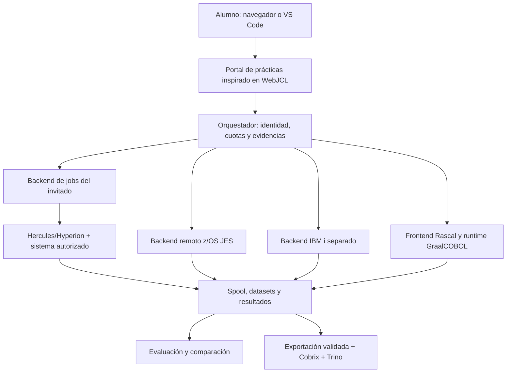

# Laboratorio mainframe: Hercules/Hyperion, migración y portal

**Estado:** arquitectura y plan de habilitación. No se han instalado emuladores, sistemas invitados, compiladores ni bases de datos.

## 1. Qué emula Hercules y qué debe aportar el laboratorio

Hercules emula procesador/dispositivos de System/370, ESA/390 y z/Architecture; el sistema operativo invitado se obtiene y configura por separado. No incluye JES, compilador COBOL, CICS ni DB2. La selección de imagen debe registrar versión, procedencia y autorización de uso; este diseño no redistribuye imágenes propietarias. [FAQ oficial de Hyperion](https://sdl-hercules-390.github.io/html/hercfaq.html).

El fork solicitado [sdk2035/hercules](https://github.com/sdk2035/hercules/tree/1a40566d755a43ce9c610caaf566484a3809da0b) procede de `opensourcemainframes/hercules`. En ese snapshot, `configure.ac` declara 3.07 mientras `RELEASE.NOTES` incluye notas 4.0. Esto impide tratar el nombre del repositorio como prueba de una release Hyperion moderna. La referencia mantenida a evaluar es [SDL-Hercules-390/hyperion](https://github.com/SDL-Hercules-390/hyperion); no se reemplaza ni actualiza el fork en este PR.

IBM i/AS400 tiene una ruta distinta sobre IBM Power. No es un invitado que este diseño prometa ejecutar con Hercules. Separar prácticas de IBM i, CL, jobs, bibliotecas y Db2 for i de las de JCL/JES y Db2 for z/OS. [IBM i](https://www.ibm.com/products/ibm-i).

## 2. Perfiles de laboratorio

| Perfil | Plataforma | Aprendizaje y condiciones |
| --- | --- | --- |
| L0 — Portátil | Linux/JVM, compilador COBOL de referencia elegido, herramientas y base relacional | COBOL, SQL y pruebas; no acredita CICS, JCL real ni IBM i |
| L1 — Emulado | Hercules/Hyperion + imagen invitada autorizada y toolchain compatible | IPL, terminal 3270, datasets y batch/JCL según el invitado disponible |
| L2 — Empresarial | Acceso autorizado a z/OS con compilador, JES, CICS y DB2 | Online, Embedded SQL, bind, recuperación y diagnósticos reales |
| L3 — IBM i | Sistema/servicio IBM i autorizado | ILE COBOL, CL, jobs y Db2 for i según herramientas disponibles |

Un invitado histórico de L1 no equivale a z/OS actual y puede carecer del dialecto COBOL, utilidades, CICS o DB2 de los ejemplos. Cada ejercicio declara perfil mínimo y alternativas; lo no disponible se marca “pendiente de entorno”, no “aprobado en emulación”.

## 3. Topología y control de trabajos

Hercules no recibe un JCL mediante una API JES universal. En L1, el adaptador debe usar las capacidades reales del invitado: lector/spool configurados o servicios disponibles. En L2, puede emplear una API de jobs del entorno autorizado. La consola de operador del emulador no se expone directamente a los alumnos.

Contratos propuestos del orquestador:

| Operación | Entrada → salida |
| --- | --- |
| Enviar | Perfil, snapshot de fuentes, JCL/solicitud, parámetros y clave idempotente → ID interno y backend |
| Consultar | ID autorizado → queued/running/succeeded/failed/cancelled/unknown y códigos nativos |
| Recuperar evidencia | ID → spool, log, manifiesto de datasets y hashes |
| Cancelar | ID → confirmación del backend o estado desconocido; no simular éxito |
| Reiniciar ejercicio | Perfil e imagen/datos de referencia → entorno aislado limpio |

Un timeout después del envío puede dejar un job activo: consultar su identidad antes de reenviar. Distinguir error de transporte de abend/código de aplicación. Controlar datasets y spool por alumno; imponer retención, límites de ejecución y limpieza verificable.

## 4. WebJCL como base de modernización

La referencia [WebJCL](https://github.com/sdk2035/webjcl/tree/3df5879279acdcd608884eceab8b693d8418751f) aporta editor web, API de jobs y abstracción de procesador. Su README enumera Node 0.8, MongoDB 2.2 y Python 2.6; `http/JobsApi.js` maneja envío con credenciales y `framework/JESWorker/ISrcProc.js` define métodos de backend. `MAINTENANCE.md` reconoce retención ilimitada de envíos.

Plan propuesto: conservar los conceptos de edición → envío → spool, crear una implementación con dependencias mantenidas y pruebas, identidad moderna, HTTPS, secretos fuera del navegador/repositorio, autorización por job y política de retención. El transporte legacy FTP/Python se sustituye por un adaptador seguro disponible en el entorno elegido. No ejecutar las instrucciones históricas que desactivan SSL ni reutilizar el despliegue sin revisión.

Un backend GraalCOBOL solo acepta capacidades declaradas: no debe fingir ejecutar cualquier JCL por delegar un cálculo a Truffle. La migración del portal necesita contratos y regresión propios.

## 5. Migrar del fork Hercules a Hyperion

1. **Inventario reproducible:** registrar commit, compilador host, configuración, extensiones locales, dispositivos, imágenes y sesiones de referencia.
2. **Seleccionar candidato:** fijar tag/SHA de Hyperion y revisar diferencias de configuración, dispositivos y licencia con el fork. No mezclar árboles automáticamente.
3. **Preparar copia:** detener consistentemente el invitado o seguir su procedimiento de backup; copiar/checksum de DASD, cintas y configuración. No abrir la misma imagen escribible desde ambos emuladores.
4. **Construir en paralelo:** entorno aislado para candidato, sin sobrescribir la instalación base.
5. **Ensayar:** IPL, terminal, submit/spool, creación/lectura de dataset, batch representativo, parada limpia y restauración.
6. **Comparar:** resultados y códigos, integridad de datos, logs e incompatibilidades; el benchmark del host no representa MIPS de producción.
7. **Promover y retornar:** cambiar el perfil de laboratorio solo tras aceptación; conservar binario/configuración e imágenes consistentes anteriores. Si cambió el estado del invitado, restaurar el conjunto completo compatible.

Los formatos de imagen y checkpoints se verifican para la pareja concreta de versiones. No se afirma portabilidad automática de estado de ejecución.

La migración de **aplicaciones COBOL** es un flujo distinto: extraer fuentes/copybooks/datos, analizarlos con Rascal, validar IR y comparar en GraalCOBOL. No se transpila el emulador C a Truffle ni se convierte una imagen DASD en programa COBOL.

## 6. Habilitación verificable

- L1 listo: arranque repetible, terminal, job y spool de referencia, exportación de dataset con encoding/longitud y restore probado.
- L2 listo: ejercicio CICS/DB2 compilado, precompilado/bound y ejecutado con evidencias del entorno.
- Portal listo: aislamiento entre dos alumnos, envío sin duplicación, cancelación y recuperación tras fallo.
- Migración lista: mismo caso en entorno legado y GraalCOBOL, con diferencias justificadas y capacidades registradas.
- Analítica lista: extracción → Cobrix → tabla → Trino con conteos/totales conciliados.

[Programa de capacitación](competencies.md) · [Adaptador Trino](../architecture/cobrix-trino.md) · [Referencias revisadas](../references/projects.md)
